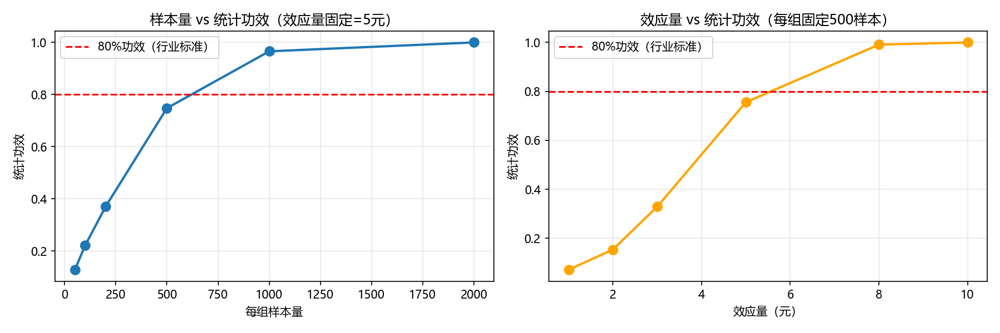

# 优惠券AB测试统计功效模拟

> 类型：Python / 假设检验
> 日期：2026-05-26

## 项目背景

定价团队要测试两种优惠券（满30减5 vs 满25减3），看哪个对客单价提升更大。上实验前需回答一个问题：**现有流量够不够？每组最少需要多少人？**

已知：用户人均消费 100 元，标准差 30 元。假设新券真实能让每人多花 5 元。

### 标准差 30 怎么来的？

**从历史数据里跑出来的，不是拍脑袋定的。**

```sql
SELECT AVG(order_amount) AS avg_gmv, STDDEV(order_amount) AS std_gmv
FROM orders
WHERE dt BETWEEN '2026-04-25' AND '2026-05-25';
```

查过去一个月的订单金额，假设返回：均值 ≈ 100，标准差 ≈ 30。

**标准差为什么关键？** 它衡量用户花钱的离散程度。标准差越大 → 用户花钱越不统一 → 随机波动越容易淹掉真实效果 → 需要更多人。

| 行业 | 标准差参考 | 检测 5 元差异需每组 N | 含义 |
|------|:---:|:---:|------|
| 便利店 | ~5 元 | ~16 人 | 客单价低且统一，小样本就够 |
| 外卖 | ~30 元 | ~566 人 | 有人点快餐有人点大餐 |
| 3C 数码 | ~500 元 | ~15,678 人 | 手机 vs 数据线，天差地别 |

**实际工作流程：**
1. 拉自己业务过去一个月的订单表，算出真实的 avg 和 std
2. 把代码里的 `100` 和 `30` 换成你算出来的数
3. 再跑 `calc_sample_size(std=你的std, mde=期望提升)` → 得到的才是你自己的业务所需样本量

---

## Part 1：统计功效模拟

### 一句话

给定每组人数，算"如果 B 组真的更好，实验能成功检出的概率"。

### 两个函数

```python
simulate_ab_test(n, effect, std)
```
1. 给 A 组 n 个用户随机生成消费（均值 100，标准差 std）
2. 给 B 组 n 个用户随机生成消费（均值 100+effect，标准差 std）
3. t 检验判差异是否显著 → 返回 True/False

```python
calc_statistical_power(n, effect, std)
```
把上面实验重复 1000 次，统计返回 True 的比例 = 统计功效。**行业要求 ≥ 80%。**

### 演示 1：固定差异 5 元，多少人才够？

| 每组人数 | 功效 | 判定 |
|:---:|:---:|:---:|
| 50 | 12.8% | 不可用 |
| 200 | 37.0% | 不可用 |
| 500 | 74.8% | 不足 |
| **1000** | **96.6%** | **达标** |

### 演示 2：固定 500 人，能检出多大效果？

| 真实差异 | 功效 | 判定 |
|:---:|:---:|:---:|
| 1 元 | 7.1% | 检不出 |
| 5 元 | 75.6% | 勉强 |
| **8 元** | **99.1%** | **可检出** |

### Part 1 结论

1. **样本量不够 = 实验白做。** 该场景每组至少 1000 人。
2. **用户波动大（std 高）→ 需要更多人摊平随机性。**
3. **期望效果越小 → 样本量要求越苛刻。**

---

## Part 2：MDE 与样本量计算

### 一句话

Part 1 是"给人数算功效"，Part 2 是反向——**给期望效果算需要多少人**，这才是实验设计的第一步。

### 两个公式（不用背，知道用途）

```
MDE = (Z_alpha + Z_power) × std × √(2/n)
n   = 2 × [(Z_alpha + Z_power) × std / MDE]²
```
`Z_alpha=1.96`（α=0.05），`Z_power=0.84`（功效=80%）

### 两个函数

```python
calc_mde(std, n)        # 当前人数下，最小能检出多大效果
calc_sample_size(std, mde)  # 要检出指定效果，需要多少人
```

### 演示 1：给定人数，能检出多大效果（MDE）

| 每组人数 | MDE | 含义 |
|:---:|:---:|------|
| 100 | 11.9 元 | 只能测大力度券 |
| 500 | 5.3 元 | 中等效果可测 |
| 1000 | 3.7 元 | 接近实际场景 |
| **5000** | **1.7 元** | **覆盖 1-3% 真实效果** |

### 演示 2：要检出指定效果，需要多少人

| 期望差异 | 需每组人数 | 含义 |
|:---:|:---:|------|
| 10 元 | 142 | 几周搞定 |
| 5 元 | 566 | 小平台吃力 |
| **2 元** | **3,529** | **需大流量** |
| 1 元 | 14,113 | 仅大厂可行 |

### 实用决策

假设 DAU = 5 万，10% 流量实验 → 每组仅 2500 人 → MDE = 3.4 元。**如果你的券预期只提升 2 元，这个实验不该做。**

---

## Part 1 + Part 2 完整流程

```
业务期望（新券提升?元）
        │
        ▼
Part 2: calc_sample_size()  →  需要多少人？
        │
        ▼
现有流量够吗？
  够 → Part 1: calc_power()  →  功效 ≥ 80%？ →  做实验
  不够 → 扩大流量 / 调整预期 / 不做实验
```

---

## 可视化



- 左图：样本量 ↑ → 功效 ↑
- 右图：效应量 ↑ → 功效 ↑

---

## 核心概念速查

| 概念 | 大白话 | 代码对应 |
|------|--------|---------|
| P 值 | "B和A其实没区别时看到这数据的概率" | t 检验返回值 |
| α | "我允许 5% 概率看走眼" | `alpha=0.05` |
| 统计功效 | "真有效果时，能检出来的概率" | `calc_power()` 输出 |
| MDE | "当前人数下，最小能检出的效果" | `calc_mde()` 输出 |

---

## 复习操作

1. 运行 `python ab_test_power_simulation.py`
2. 改 `effect=5` → `2`，改 `std_dev=30` → `50`，重新跑
3. 观察功效怎么变、为什么

---

> 代码：[ab_test_power_simulation.py](ab_test_power_simulation.py)
> 图表：[ab_test_power.png](ab_test_power.png)
